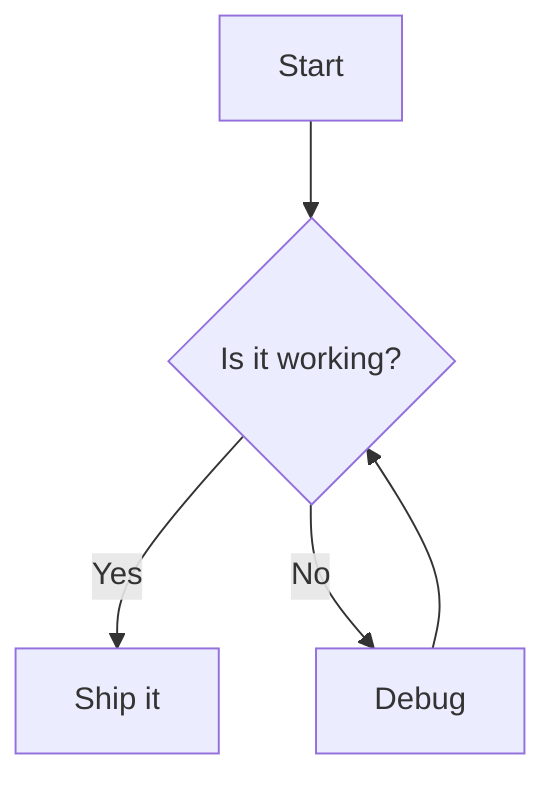
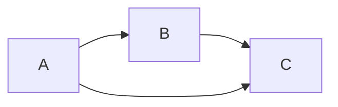

# Mermaid Fixture

A simple flowchart:

```mermaid
flowchart TD
  A[Start] --> B{Is it working?}
  B -->|Yes| C[Ship it]
  B -->|No| D[Debug]
  D --> B
```

Some prose between diagrams.

```mermaid
flowchart LR
  A --> B --> C
  A --> C
```

End of fixture.
